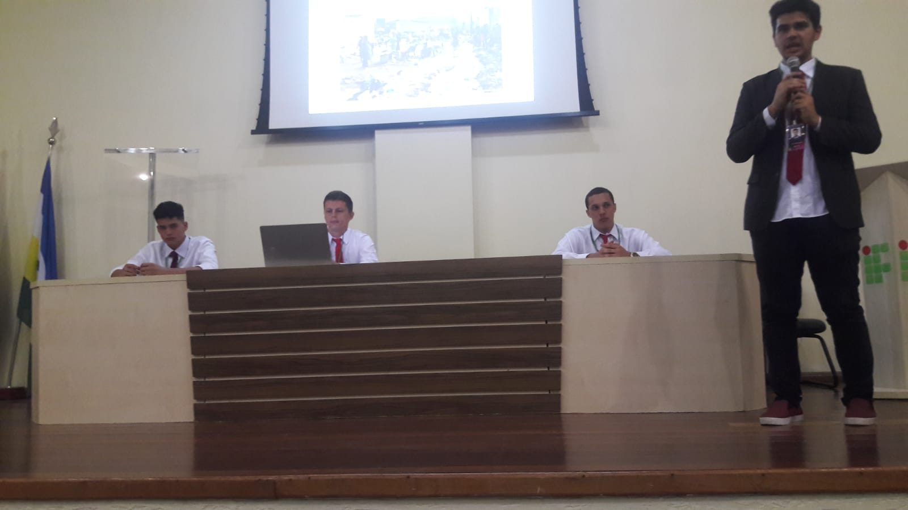
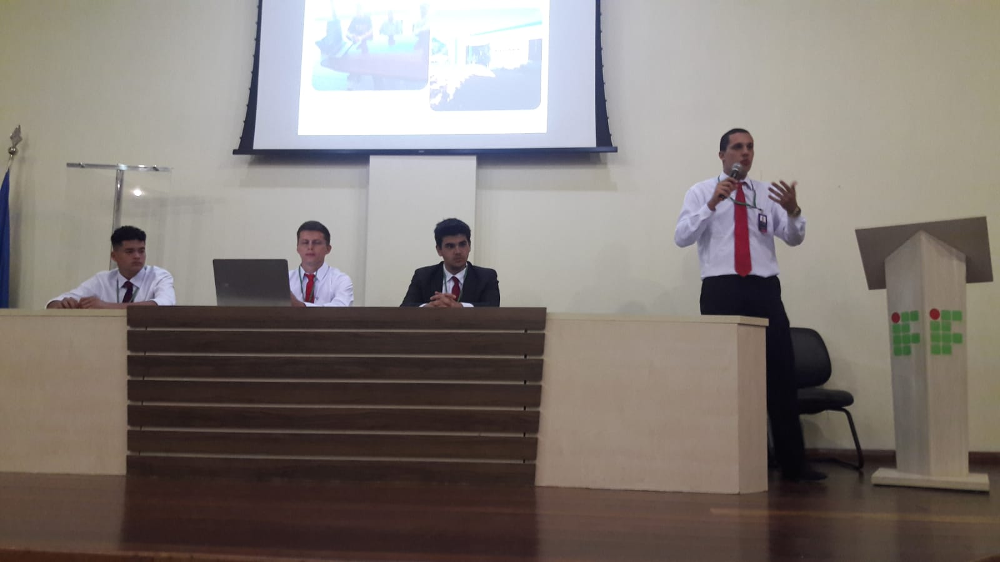
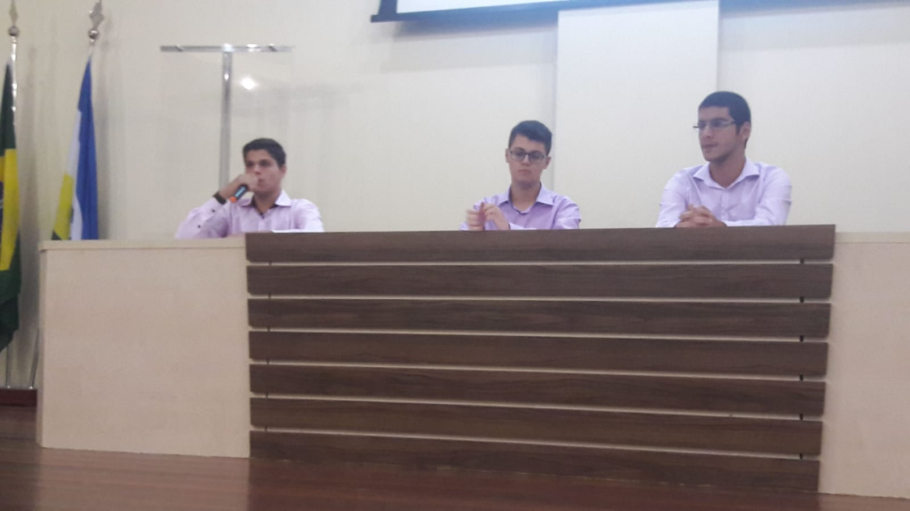
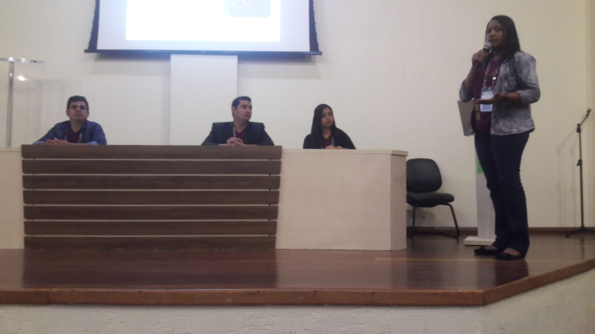

# 2018
## Apresentação da Disciplina de Língua Portuguesa Aplicada
Projeto de Ensino "O desvendar de romances angolanos: as tecnologias em prol da leitura dos clássicos".

[+ fotos](ens3rosa.md)
