# 2016
## Apresentação de Projeto de Ensino
### Linguagem literária e cinematográfica: olhares críticos e tecnológicos direcionados ao continente africano

[+ fotos](ens1rosa.md)

# 2017
## Apresentação de Projeto de Pesquisa (Metodologia Científica)
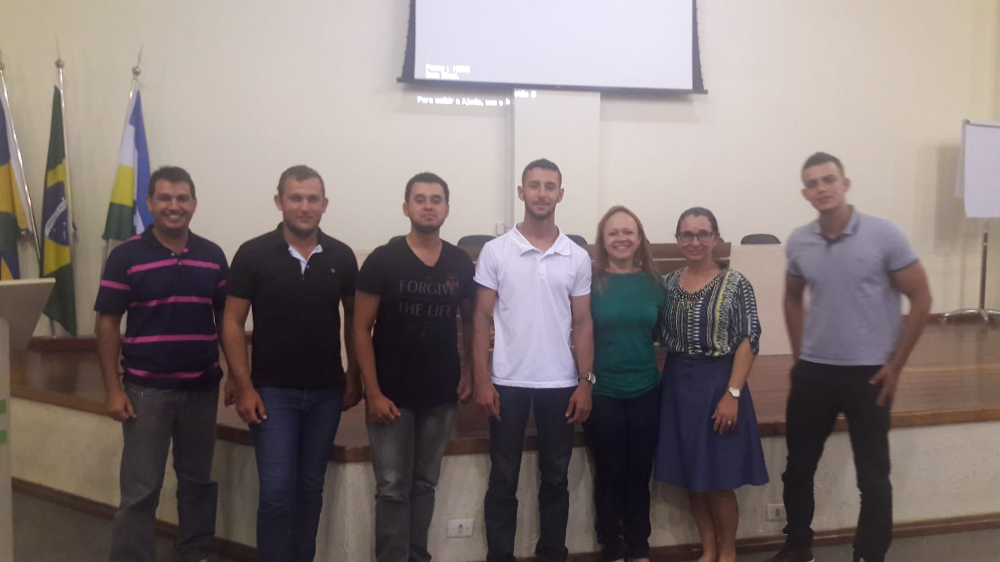
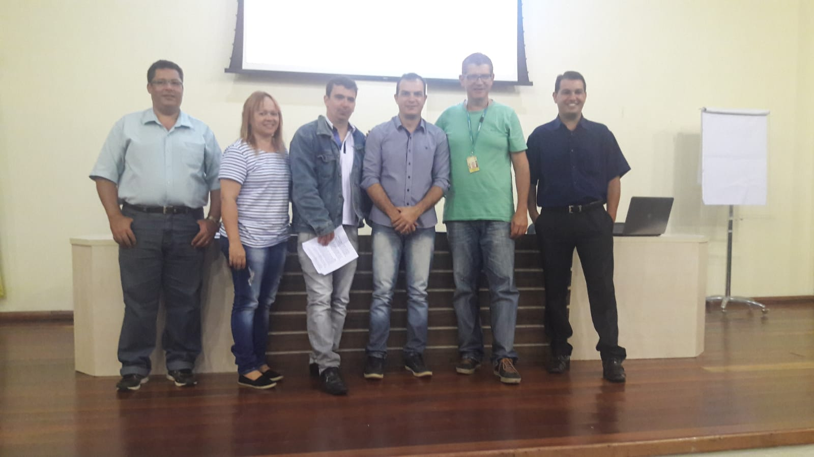

## Apresentação da Disciplina de Comunicação e Expressão
As equipes formadas representam os funcionários de uma Empresa Multinacional no segmento de informática. Vocês, enquanto trabalhadores da empresa, foram contratados pelo diretor de uma escola para desenvolverem técnicas e/ou programas de computação que proporcionem aos discentes do ensino médio a leitura de contos das literaturas africanas. 

[+ fotos](ens2rosa.md)

## Campus Party 10, São Paulo
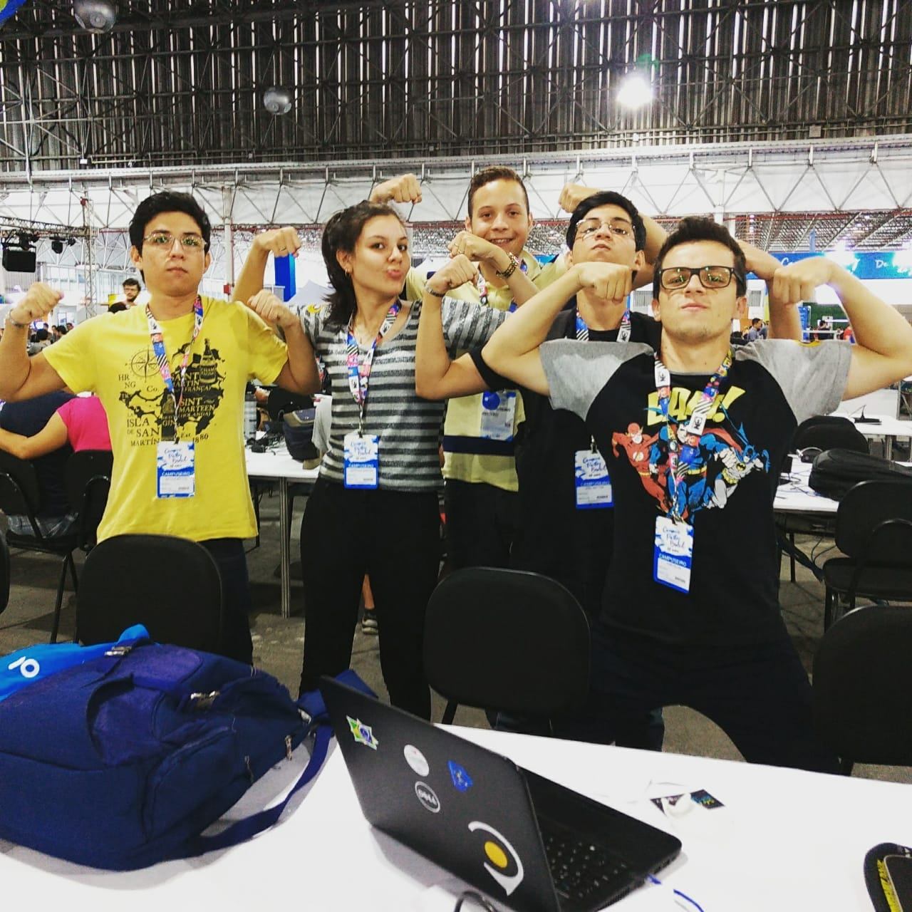

## Startup Weekend, Porto Velho
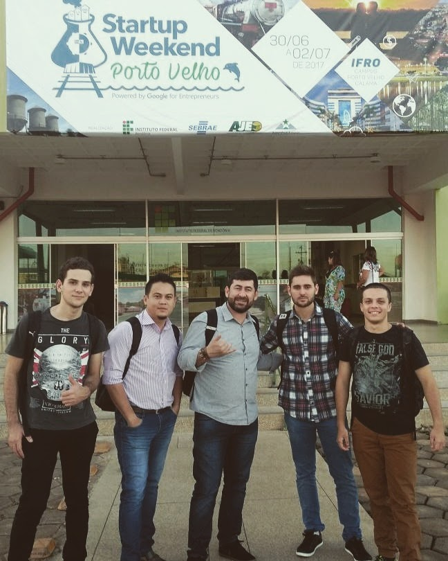

## CONPEX, Porto Velho
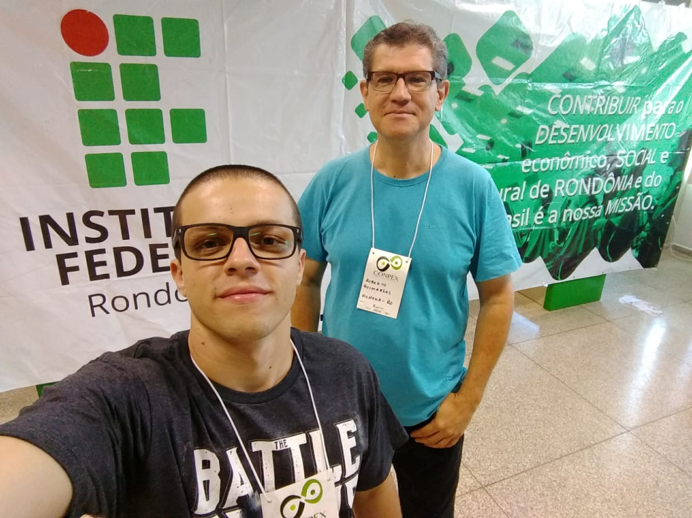

## Maratona de Programação, Foz do Iguaçu
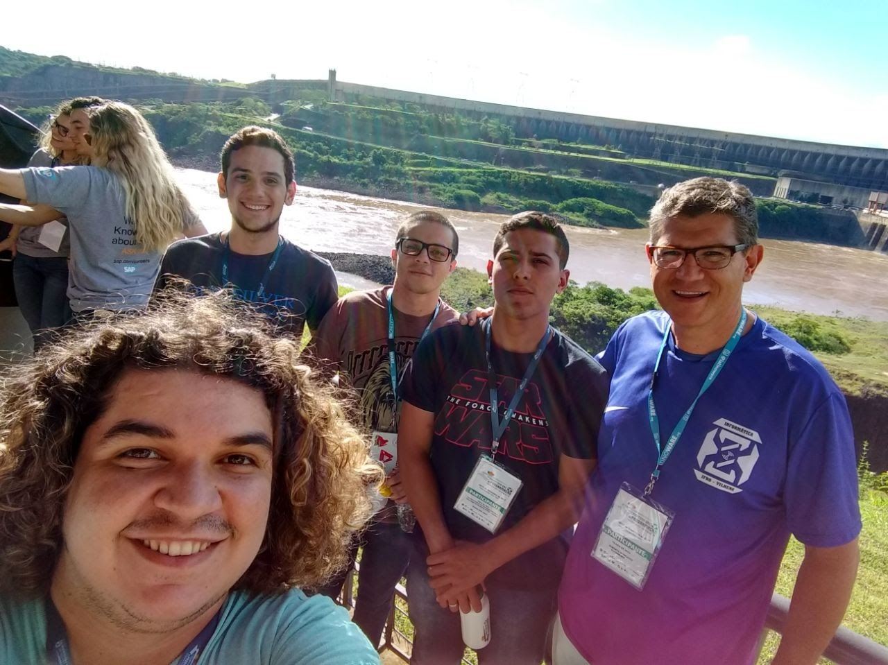 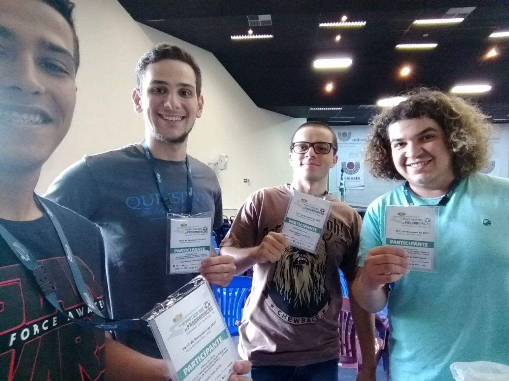

## II Infoparty
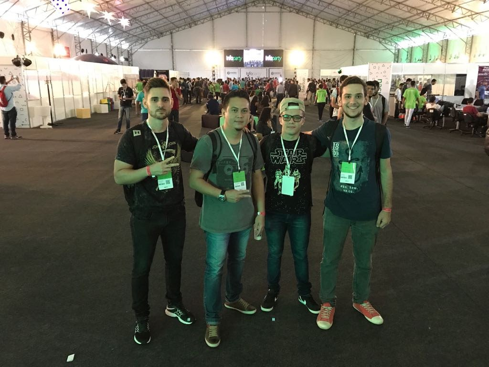

## 7º Seminário de Iniciação Científica do Campus Colorado do Oeste
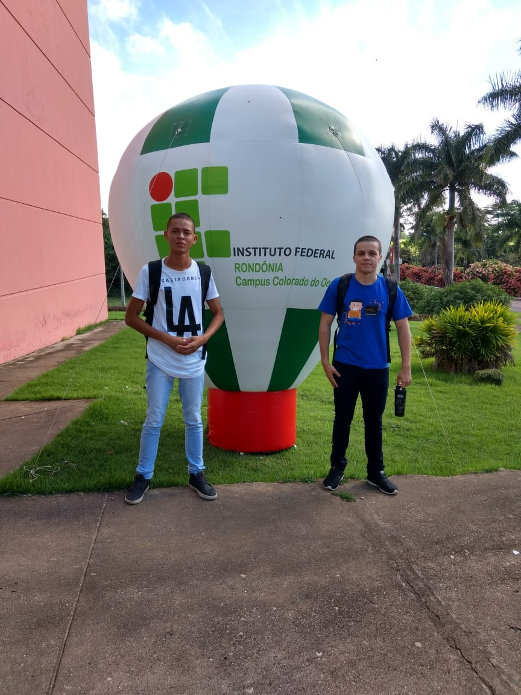

# 2018
## Apresentação da Disciplina de Língua Portuguesa Aplicada
Projeto de Ensino "O desvendar de romances angolanos: as tecnologias em prol da leitura dos clássicos".

[+ fotos](ens3rosa.md)

## Campus São Paulo, São Paulo
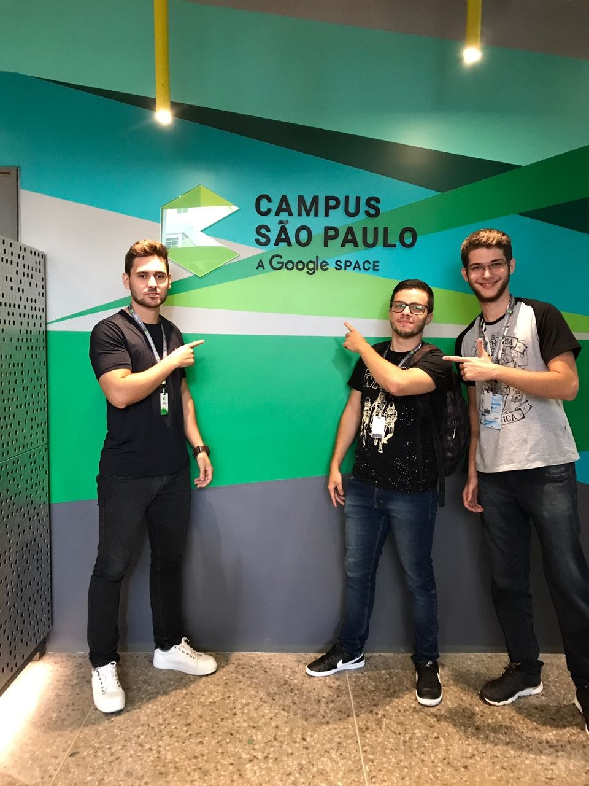

## Campus Party 11, São Paulo
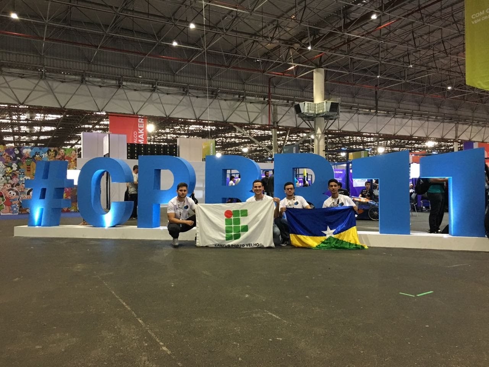

## Campus Party Rondônia, Porto Velho
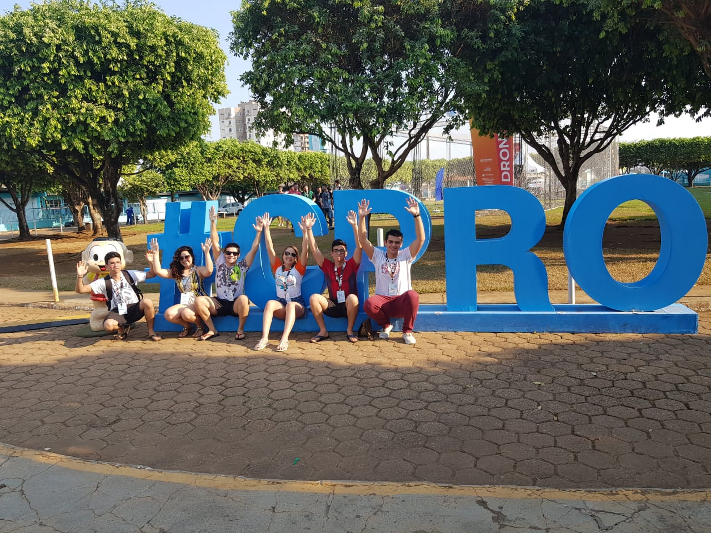

## Congresso Norte-Nordeste de Pesquisa e Inovação (CONNEPI)
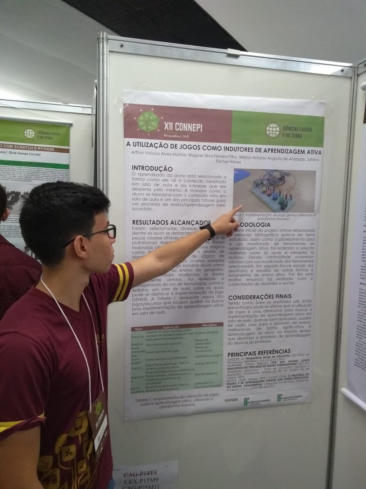

## Congresso de Ensino Pesquisa e Extensão do IFRO (CONPEX)
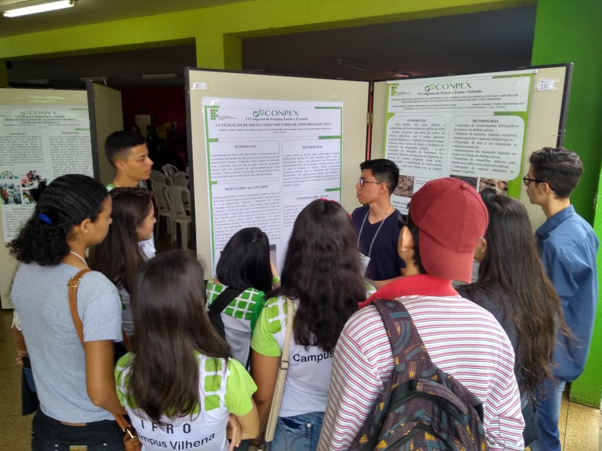
